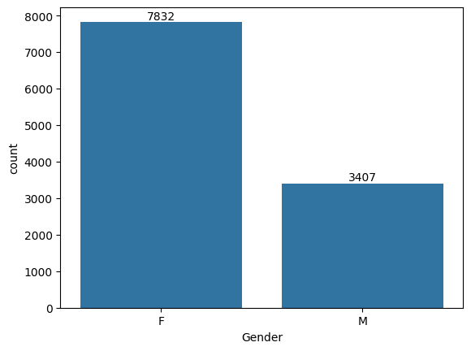

# 🪔 Diwali Sales Data Analysis

## 📌 Project Overview
This project analyzes **Diwali Sales Data** to uncover customer purchasing patterns, demographics, and sales trends.  
The goal is to help businesses optimize marketing strategies, identify target customers, and boost sales during festive seasons.

---

## 📊 Dataset
- **File:** `Diwali Sales Data.csv`  
- **Key Columns:**
  - `User_ID` – Unique customer ID
  - `Gender` – Male/Female
  - `Age Group` – Age segmentation
  - `State` – Customer location
  - `Occupation` – Profession of customer
  - `Product_Category` – Purchased product category
  - `Amount` – Total purchase amount

---

## 🛠️ Exploratory Data Analysis (EDA)
Performed using **Python (Pandas, Matplotlib, Seaborn)**:
1. Data Cleaning (handling null values, type conversions)
2. Descriptive Statistics
3. Visualization of customer demographics, sales distribution, and purchasing trends

---

## 📈 Key Insights

### 👩 Gender Distribution
- **Females (~70%)** purchased more compared to Males (~30%).
- Women contributed to **higher overall sales**.

---

### 🎯 Age Group
- **26–35 years** is the dominant age group of buyers.
- Followed by **36–45** and **18–25**.
- 26–35 contributes the **highest purchase amount**.

  

---

### 💼 Occupation
- Highest spenders: **IT Sector, Healthcare, Aviation**.
- Medium spenders: **Banking, Govt, Hospitality**.
- Lowest spenders: **Agriculture, Textile, Construction**.

  

---

### 🗺️ State-wise Sales
- **Top States:** Uttar Pradesh, Maharashtra, Karnataka.
- **Moderate Sales:** Delhi, Madhya Pradesh, Andhra Pradesh.
- **Low Sales:** Gujarat, Bihar, Haryana.

---

### 🛒 Product Categories
- **Most Popular:** Clothing & Apparel, Food, Electronics & Gadgets.
- **Moderate:** Footwear, Household Items, Beauty.
- **Least Popular:** Veterinary, Tools, Decor.

---

## 🚀 Business Recommendations
- **Target Audience:** Focus on **female customers aged 26–35 years** working in **IT, Healthcare, and Aviation**.
- **Top Locations:** Offer discounts & promotions in **Uttar Pradesh, Maharashtra, Karnataka**.
- **Product Strategy:** Stock more **Clothing, Food, Electronics** items before Diwali.
- **Improve Weak Segments:** Re-strategize **Agriculture, Tools, Decor** categories.

---

## 🛠️ Tools & Libraries
- Python 🐍
- Pandas
- NumPy
- Matplotlib
- Seaborn
- Jupyter Notebook

---

## 📌 Author
**Kajal Kewat**  
🎯 Aspiring Data Analyst | Python | SQL | EDA | Visualization  

---

